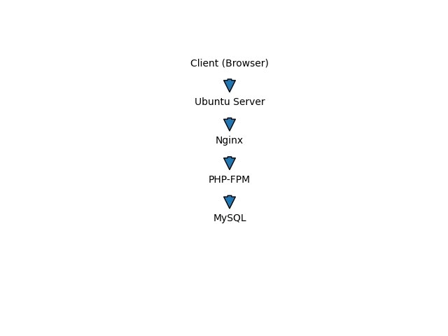

# Dynamic Website Hosting on Ubuntu Server With LEMP 

## Introduction :-

This project demonstrates how to host a dynamic website on an Ubuntu server using the **LEMP** stack (Linux, Nginx, MySQL, PHP).

The LEMP stack is a popular open-source web stack used to deploy dynamic websites and web applications. It consists of:

* Linux – Operating System (Ubuntu)

* Nginx – Web Server

* MySQL – Database Management System

* PHP – Server-side scripting language

This guide walks through installing and configuring each component to successfully host a PHP-based dynamic website.

## 🖥️ Prerequisites

* Ubuntu Server (20.04 / 22.04 recommended)

* Minimum 1 GB RAM
* Sudo privileges
* Internet connection

## Architecture diagram


## Step 1

Take the access of your server 
.png)

## Step 2 - Installation
1) Update the system 
.png)

2) install nginx
.png)

3) install MySql
.png)

4) install php
.png)

5) install php-fpm 
.png)

6) start and enable the services
.png)

## Step 3 - Create index.html and info.php files inside the default nginx folder
1) index.html
.png)
2) info.php
.png)


## Step 4 - create a database 

```
CREATE DATABASE mywebsite;
CREATE USER 'myuser'@'localhost' IDENTIFIED BY 'password';
GRANT ALL PRIVILEGES ON mywebsite.* TO 'myuser'@'localhost';
FLUSH PRIVILEGES;
EXIT;
```


## Step 5 - Configure nginx for php 

.png)
.png)


## Step 6 - check on browser
.png)
.png)

## Setup Successful
Nginx handles client requests, PHP-FPM processes application logic, and MySQL manages database operations.The setup provides a secure, high-performance, and scalable environment for deploying dynamic web applications.

